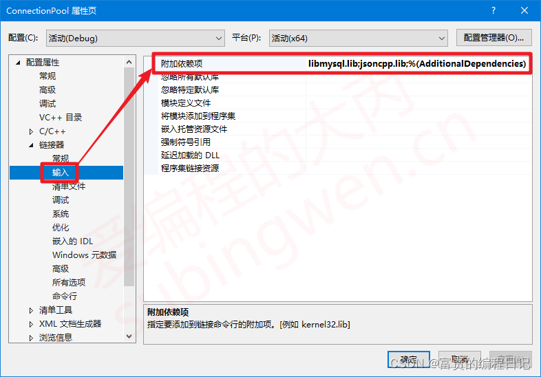

# ETOCK Reservation System (Easy To Check预约系统)

> 基于C++实现的票务预约系统，支持用户注册、登录、票务查询、预订及取消功能  
> 系统依赖：`libevent`, `jsoncpp`, `mysqlclient`  
> 当前版本：v1.0 (仅支持Linux系统)

---

## 项目概述
一个基于C++实现的分布式票务管理系统，提供以下核心功能：
- **用户端**：注册/登录、票务查询、在线预订、订单管理、取消预订
- **服务端**：高并发请求处理、数据库交互、事务管理、JSON数据编解码
- **管理端**：直接数据库操作、票务管理、用户状态管控、黑名单机制

## 技术栈全景

### 1. 核心语言
- **C++11**：作为系统主要开发语言
- **SQL**：用于数据库操作

### 2. 网络架构
| 组件        | 技术方案                 | 说明                          |
|------------|-------------------------|-----------------------------|
| 通信协议    | TCP/IP                  | 可靠传输保证                  |
| 并发模型    | libevent事件驱动         | 单线程事件循环处理高并发       |
| 数据序列化  | JSON（jsoncpp库）        | 请求/响应结构化数据交换        |

### 3. 数据库系统
- **MySQL 8.0+**：关系型数据库存储

## 协议设计

### 请求/响应格式
- **数据格式**: JSON  
- **操作类型** (`type`字段):  
  | 类型       | 值  | 说明               |
  |-----------|-----|-------------------|
  | LOGIN     | 1   | 用户登录           |
  | REGISTER  | 2   | 用户注册           |
  | EXIT      | 3   | 退出系统           |
  | VIEW      | 4   | 查看所有票务       |
  | ORDER     | 5   | 预定票务           |
  | VIEW_MY   | 6   | 查看个人预定记录   |
  | CANCEL    | 7   | 取消预定           |

---

## 模块说明

### Server 服务器
#### 功能
1. 使用 `libevent` 实现高并发网络通信
2. 通过MySQL管理用户数据 (`user_info`)、票务数据 (`ticket_info`)、预定记录 (`sub_ticket`)
3. 处理客户端请求，返回JSON格式响应

#### 核心类
- **`mysql_client`**: 封装数据库操作  
  - `mysql_ConnectServer()`: 连接数据库  
  - `mysql_login()/mysql_register()`: 用户登录/注册  
  - `mysql_Subscribe_Ticket()/mysql_Cancel_Ticket()`: 票务预定/取消  
  - 事务管理: `mysql_user_begin()`, `mysql_user_commit()`, `mysql_user_rollback()`

- **`socket_listen`**: 监听端口，接受客户端连接  
- **`socket_connect`**: 处理客户端请求，解析JSON并调用对应方法

#### 数据库表结构

```sql
-- 用户表
create table user_info(
    userid int primary key not null unique auto_increment,
    tel char(11) not null unique,
    uesrname varchar(20) not null,
    passwd varchar(17) not null,
    status tinyint not null
);

-- 票务表
create table ticket_info(
    tk_id int primary key not null unique auto_increment,
    addr varchar(20),
    max int, 
    num int,
    use_date date,
    status TINYINT
);

-- 预定记录表
create table sub_ticket(
    yd_id int primary key not null unique auto_increment,
    tk_id int not null,
    tel char(11) not null,
    curr_time DATETIME not null
);
```
#### 数据库表

##### 用户表


##### 票务表


##### 预定记录表


### Client 客户端

#### 功能
1. 提供命令行交互界面
2. 发送JSON请求，解析服务器响应
3. 支持两种界面状态：
   - **未登录**: 显示登录/注册选项
   - **已登录**: 显示票务操作选项

#### 核心方法
- `Connect_server()`: 连接服务器  
- `login()/register_()`: 登录/注册逻辑  
- `view()/order()/view_my()/cancel()`: 票务操作  
- 输入验证：手机号格式、密码复杂度（需包含数字、大小写字母）

#### 界面示例

##### 未登录


##### 已登录


### Admin 管理员模块
#### 核心功能
1. **票务管理**
   - 添加新票务（场馆名称、总票数、使用日期）
   - 查看所有票务信息（含实时预订统计）
2. **用户管理**
   - 查看所有注册用户信息
   - 查看/管理黑名单用户（加入/移出黑名单）

#### 核心类说明
- **`AdminManager`**: 管理员功能主控类
  - `ConnectDB()`: 直连MySQL数据库（无需通过服务端）
  - `Run()`: 控制台交互主循环
  - 黑名单管理方法: 
    - `AddToBlacklist()`: 通过手机号封禁用户
    - `RemoveFromBlacklist()`: 恢复用户权限

#### 操作界面示例


#### 典型操作流程
1. **添加票务**
   ```text
   场馆名称: 国家大剧院
   总票数: 500
   使用日期(YYYY-MM-DD): 2023-12-25
   → 自动初始化已预订数为0
   ```

2. **用户封禁**
   ```text
   输入手机号: 13812345678
   → 自动验证用户存在性
   → 更新user_info.status字段
   ```

#### 注意事项
1. 管理员系统直接操作数据库，需确保：
   ```cpp
   // admin.hpp中的数据库配置与实际环境一致
   db_ip = "127.0.0.1";       // MySQL服务器IP
   db_user = "root";          // 数据库账号
   db_passwd = "zbk";         // 数据库密码
   ```
2. 票务状态字段控制逻辑：
   - 状态为0时用户端不可见
   - 可通过`UPDATE ticket_info SET status=0 WHERE tk_id=1`手动下架票务

#### 安全建议
1. 生产环境应使用独立数据库账号并限制权限
2. 建议增加操作日志记录功能
3. 敏感操作（如黑名单管理）可增加二次确认

---

## 编译与运行

### 依赖安装
```bash
# Ubuntu
sudo apt install libevent-dev libjsoncpp-dev libmysqlclient-dev
```

### Server
```bash
g++ -o ser ser.cpp -levent -ljsoncpp -lmysqlclient
./ser
```

### Client
```bash
g++ -o client client.cpp -ljsoncpp
./client
```

### Admin
```bash
g++ -o admin admin.cpp -lmysqlclient
./admin
```
---
## Win环境配置

### mysql.h
找到mysql.h文件
mysql.h文件通常位于MySQL的include目录中。例如：C:\Program Files\MySQL\MySQL Server 8.0\include。

配置项目包含目录

打开Visual Studio，创建或打开你的C/C++项目。
在“解决方案资源管理器”中，右键点击项目名称，选择“属性”。
在“属性页”中，展开“C/C++”节点，选择“常规”。
在“附加包含目录”中，添加MySQL的include目录路径，例如：C:\Program Files\MySQL\MySQL Server 8.0\include。
点击“应用”和“确定”保存设置。
配置项目库目录

在“属性页”中，展开“链接器”节点，选择“常规”。
在“附加库目录”中，添加MySQL的lib目录路径，例如：C:\Program Files\MySQL\MySQL Server 8.0\lib。
点击“应用”和“确定”保存设置。
添加库文件

在“属性页”中，展开“链接器”节点，选择“输入”。
在“附加依赖项”中，添加mysqlclient.lib。
点击“应用”和“确定”保存设置。

### jsoncpp

1. 下载和编译
   
   下载内容 ： jsoncpp 、 cmake 、 Visual Studio 2022 (IDE)
	
	jsoncpp : 编译的json库；
	
	cmake ： make编译工具，生成MakeFile，指定编译规则；
	
	IDE： 编译；
	
	1.1 下载 jsoncpp
	Jsoncpp 是个跨平台的 C++ 开源库，提供的类为我们提供了很便捷的操作，而且使用的人也很多。在使用之前我们首先要从 github 仓库下载源码，地址如下： https://github.com/open-source-parsers/jsoncpp

	1.2 cmake工具下载
    	   
	于 C++ 程序员都是基于 VS 进行项目开发，下载的源码我们一般不会直接使用，而且将其编译成相应的库文件（动态库或者静态库），这样不论是从使用或者部署的角度来说，操作起来都会更方便一些；
    	   
	但是 ，直接在github 下载的源码不能直接在 VS 中打开，我们需要现在 cmake工具将下载的项目构建成一个 VS 项目 ，随后使用 VS 编译出需要的 库文件；
    	
	CMake 下载地址：https://cmake.org/download/ 

​	1.3 使用 cmake 生成 VS 项目

​	

​	第一行选择git下载的jsoncpp文件夹，自动新建并选择输出文件夹jsoncpp_out，如图勾选后点击Configure进行配置，选择合适配置后点击Finish，完成后点击Generate生成，编译完成。

​	使用 VS 找到`输出目录`中的 `.sln` 文件打开

​	

​	右键选择jsoncpp_lib点击生成

​	新建一个文件夹 jsoncpp，存放库文件和对应头文件,将从github下载源文件夹中 include 文件夹 拷贝到 jsoncpp文件夹中
​	jsoncpp 中新建库文件夹lib 将刚才cmake输出文件夹中 `lib/Debug/jsoncpp.lib`和`bin/Debug/jsoncpp.dll` 放入该文件夹

​1.4 项目配置环境
	1.4.1 包含目录
	​
	​将你新建的jsoncpp文件夹下的include包含在其中
	​1.4.2 加载的动态库
	​
	​添加jsoncpp.lib文件

### libevent

本项目仓库中提供生成好的静态库libevent

（1）下载解压后复制libevent文件夹。
（2）确保该项目中有一个.cpp文件
（3）属性->VC++目录->包含目录->libevent\include路径
（4）属性->VC++目录->包含目录->libevent\WIN32-Code\nmake
（5）属性->VC++目录->库目录->libevent\lib
（6）属性->链接器->输入->附加依赖项->libevent.lib libevent_core.lib libevent_extras.lib

(还剩下什么实在调不动了,就这样吧,有空再继续弄)


## 注意事项

1. 确保MySQL服务已启动，且数据库`Project_DB`存在（配置见`ser.cpp`中`mysql_client`构造函数）
2. 若登录失败，检查SQL语句拼写（如`uesrname`应为`username`）
3. 服务器默认监听`127.0.0.1:6000`，可按需修改`socket_listen`类参数

## 改进方向
1. **安全性增强**  
   - 采用预处理语句防止SQL注入
   - 密码加密存储（建议bcrypt算法）

2. **性能优化**  
   - 引入连接池减少MySQL连接开销
   - 增加Redis缓存热门票务数据

3. **功能扩展**  
   - 分布式部署支持
   - 微信/支付宝支付集成
   - 可视化监控仪表盘
